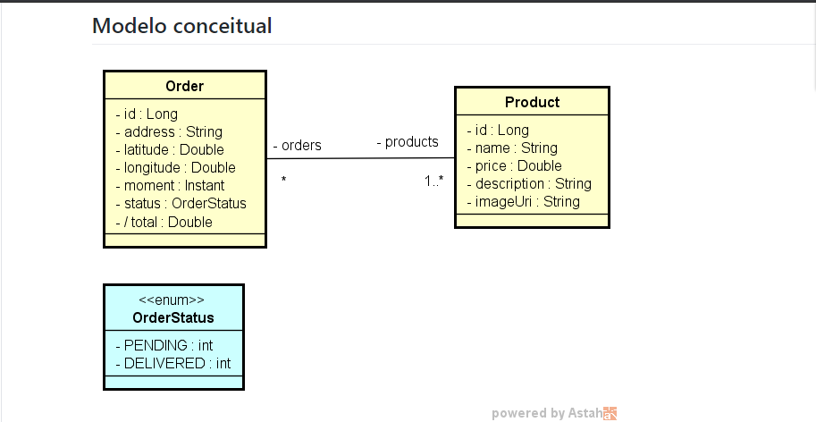

<h4 align="center">
    :computer: Aplicativo Web de entrga de pedidos - DSDeliver-sds2
</h4>

<p align="center">
    <a href="#-projeto">Projeto</a>&nbsp;&nbsp;&nbsp;|&nbsp;&nbsp;&nbsp;
    <a href="#rocket-tecnologias">Tecnologias</a>&nbsp;&nbsp;&nbsp;|&nbsp;&nbsp;&nbsp;
    <a href="#user-content-clipboard-instruções">Instruções</a>&nbsp;&nbsp;&nbsp;|&nbsp;&nbsp;&nbsp;
    <a href="#-ajustes-e-melhorias">Melhorias</a>
</p>


<div align="center">
    
</div>
<br/>

## 💻 Projeto

- Frontend App em ReactJS. Aplicação frontend para registro de pedido delivery de pizza, informando o local através do mapa
- API em SpringBoot Java. Aplicação backend para crud de pedidos e produtos
- App Mobile em ReactNative. Aplicação mobile para motoboy dar baixa nos pedidos

<br>

## :rocket: Tecnologias

- [Java](https://www.java.com/pt-BR/)
- [Typescript](https://www.typescriptlang.org/)
- [Spring Boot](https://spring.io/)
- [ReactJS](https://pt-br.reactjs.org/)
- [ReactNative](https://reactnative.dev/)
- [HTML5](https://developer.mozilla.org/pt-BR/docs/Web/Guide/HTML/HTML5)
- [CSS3](https://developer.mozilla.org/pt-BR/docs/Web/CSS)
- [React Leaflet](https://react-leaflet.js.org/)
- [Axios](https://axios-http.com/)

## :clipboard: Instruções

---

### INTERFACE - FRONTEND | MOBILE

- Execute `$ npm i` para instalar todas as dependencias.
- Após todas as dependencias serem instaladas e as variáveis serem preenchidas, basta executar `npm start` para iniciar a interface frontend ou mobile.

---

### ATENÇÃO: O PROJETO NÃO RODA LOCALMENTE NO PROFILE PROD! Para rodar o projeto localmente, mude para o profile test.

```bash
heroku login
heroku git:remote -a <nome-do-app>
git remote -v
git subtree push --prefix backend heroku main
```

### Link Semana-DEVSuperior

https://github.com/devsuperior/sds2

### Links:

- Link interface frontend-web:
  https://ygor-salles-sds2.netlify.app/

- Link interface frontend-mobile:
  https://dsdeliver-mobile.netlify.app/

- Link do backend:
  https://ygor-dsdeliver.herokuapp.com/

---

## 📌 Ajustes e melhorias

O projeto ainda está em desenvolvimento e as próximas atualizações serão voltadas nas seguintes tarefas:

- [ ] Modificar botões do front-mobile pois estão com erro
- [ ] Inserir loading ao clicar em fazer pedido do frontend web
- [ ] Inserir loading clicar em ver pedidos do front-mobile
